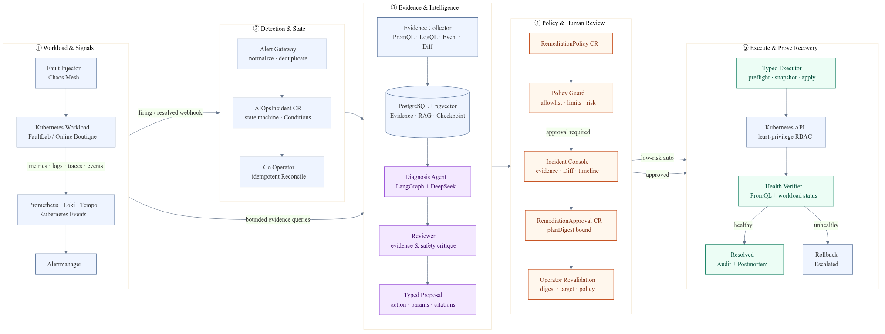
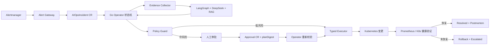

# AegisOps 项目设计

> 面向 Kubernetes 的证据驱动智能诊断与受控自愈平台

文件级与函数级施工规范见：[AegisOps 全量实现蓝图](./aegisops-implementation-blueprint.md)。

## 1. 项目结论

项目不做“让大模型直接执行 kubectl”的聊天机器人，而是构建一套可以解释、审批、回滚和审计的可靠性控制面：

`Alertmanager 告警 → 指纹去重 → 多源证据快照 → RAG 检索 → DeepSeek 诊断 → 二次审查 → 确定性策略校验 → 人工审批或低风险自动放行 → Operator 类型化执行 → 健康验证 → 失败回滚 → 事故报告`

建议项目名：**AegisOps**。简历标题使用：

> **AegisOps：面向 Kubernetes 的证据驱动智能诊断与受控自愈 Operator**

它与现有“ACK + ACR + GitLab CI + Argo CD”项目形成上下游关系：第一个项目回答“如何可靠交付”，AegisOps 回答“上线后如何发现、诊断并安全恢复”。新项目不再把 CI/CD、Terraform、多云等内容塞进主线。

## 2. 核心卖点

1. **闭环完整**：不是单点 LLM Demo，而是从告警到恢复验证的事故响应闭环。
2. **AI 与执行权分离**：DeepSeek 只能返回满足 JSON Schema 的候选方案，没有 kubeconfig；集群写操作只能经过 Operator 的固定动作实现。
3. **证据驱动**：结论必须引用 PromQL、LogQL、Kubernetes Event、工作负载变更和 RAG Runbook，缺少证据时必须降级为“需要人工排查”。
4. **安全可证明**：风险分级、动作白名单、参数边界、方案摘要哈希、最小权限 RBAC、并发锁、幂等执行、超时回滚和完整审计。
5. **效果可测量**：用可重复的故障注入和带真值的数据集测根因命中率、检索 Hit@K、危险方案拦截率、修复成功率和 MTTR，而不是预先编造 95% 等数字。

## 3. 项目边界

### 必须实现

- Alertmanager Webhook 接入、告警归一化、指纹去重和 resolved 处理。
- Prometheus、Loki、Kubernetes Event、Deployment/ReplicaSet 变更历史的证据采集。
- DeepSeek 结构化诊断，RAG 引用 Runbook，诊断 Agent 与 Reviewer 两阶段审查。
- Go + Kubebuilder Operator、CRD 状态机、Conditions、幂等和冲突重试。
- 类型化修复动作、风险策略、人工审批、恢复验证和失败回滚。
- Grafana 事故响应大盘、端到端 Trace、Web 事故控制台。
- 6 类故障、自动化演练、评估报告、CI、架构文档、演示视频和复盘文章。

### 明确不做

- 不允许模型生成或执行任意 Shell、kubectl、Python 代码。
- 不修改 Secret、RBAC、Namespace、PVC，不执行节点级操作。
- 不做跨集群调度、多租户 SaaS、复杂 ChatOps 和预测式扩缩容。
- 不宣称“生产可用”或“替代 SRE”，定位为面向生产约束的工程实验平台。

## 4. 总体架构

架构源文件：`aegisops-architecture.mmd`。





### 组件职责

| 组件 | 实现 | 职责与权限 |
|---|---|---|
| `alert-gateway` | Go | 接收 Alertmanager Webhook，验证输入，计算事件指纹，创建或更新 Incident；只能写 Incident CR |
| `aegisops-operator` | Go / Kubebuilder | 驱动状态机、采集证据、调用诊断、校验策略、执行动作、验证和回滚 |
| `diagnosis-service` | Python / FastAPI / LangGraph | RAG、DeepSeek 调用、Reviewer 审查和结构化输出；无 Kubernetes 写权限 |
| `policy-guard` | Go 内部包 | 对动作类型、目标、参数、频率、风险、环境和审批摘要进行确定性判断 |
| `incident-console` | React/Vite | 展示证据、引用、方案 Diff、策略判定和时间线；发起批准或拒绝 |
| PostgreSQL + pgvector | 单实例 | 保存 RAG 文档与向量、LangGraph checkpoint、原始证据、LLM 输入输出和审计事件 |
| Prometheus/Loki/Tempo/Grafana | Helm | 指标、日志、追踪、告警与演示大盘 |
| `fault-lab` | Go + Chaos Mesh/脚本 | 提供稳定、可复现且带 ground truth 的故障场景 |

## 5. Kubernetes API 设计

只设计 3 个 CRD，避免为了显得复杂而制造资源类型。

### 5.1 AIOpsIncident

代表一次被去重后的事故，也是控制循环流程状态的唯一事实源。

```yaml
apiVersion: ops.aegis.io/v1alpha1
kind: AIOpsIncident
metadata:
  name: checkout-oom-8e1f2a
spec:
  fingerprint: "sha256:..."
  source: alertmanager
  severity: critical
  targetRef:
    apiVersion: apps/v1
    kind: Deployment
    namespace: fault-lab
    name: checkout-api
  startedAt: "2026-08-01T10:00:00Z"
status:
  phase: AwaitingApproval
  observedGeneration: 1
  evidenceRef: evidence-01J...
  diagnosis:
    category: OOMKilled
    rootCause: memory limit lower than observed working set
    confidence: 0.91
    evidenceIDs: [event-4, prom-2, log-7]
    runbookRefs: [runbook://k8s/oom-v2#step-3]
  proposal:
    action: PatchResourceLimit
    parameters:
      container: app
      memory: 384Mi
    risk: medium
    planDigest: "sha256:..."
  conditions: []
```

### 5.2 RemediationPolicy

声明哪些命名空间、工作负载和动作可用，以及自动执行或必须审批。

```yaml
apiVersion: ops.aegis.io/v1alpha1
kind: RemediationPolicy
metadata:
  name: fault-lab-default
spec:
  namespaceSelector:
    matchLabels:
      aegisops.io/managed: "true"
  allowedTargetKinds: [Deployment]
  actions:
    RestartWorkload:
      mode: Auto
      cooldown: 10m
    ScaleDeployment:
      mode: ApprovalRequired
      maxReplicaDelta: 2
      maxReplicas: 8
    PatchResourceLimit:
      mode: ApprovalRequired
      maxMemory: 1Gi
    RollbackDeployment:
      mode: ApprovalRequired
    RestoreConfigMap:
      mode: ApprovalRequired
  maxAttemptsPerIncident: 1
  verificationWindow: 2m
  rollbackOnVerificationFailure: true
```

### 5.3 RemediationApproval

审批对象不可只写一个 `approved: true`。它必须绑定 Incident UID、`proposalRevision` 和 `planDigest`；摘要内部绑定目标 resourceVersion 与 Policy generation。方案或目标变化后旧审批自动失效，无关 Status 更新不会误伤审批。审批 CR 创建后通过 CEL/Admission Validation 禁止修改，只允许重新创建。

## 6. Incident 状态机

```text
Detected
  → CollectingEvidence
  → Diagnosing
  → PolicyChecking
  → AwaitingApproval ──reject/timeout──→ Escalated
  → Executing
  → Verifying ──healthy──→ Resolved
              └─unhealthy→ RollingBack → RolledBack → Escalated
```

实现要求：

- 每个阶段使用标准 `status.conditions` 表达 Ready、EvidenceReady、DiagnosisReady、PolicyAllowed、Approved、Remediated、Verified。
- `observedGeneration` 防止旧状态覆盖新 Spec。
- 执行动作使用 `incidentUID + planDigest` 作为幂等键。
- 同一目标用 Kubernetes Lease 或内存外锁保证同一时刻最多一个执行中的 Incident。
- API 更新使用 `RetryOnConflict`；Controller 开启 leader election、限速队列和指数退避。
- Reconcile 不同步等待 DeepSeek：它以幂等键提交异步 Analysis 任务、记录 task ID 后返回；诊断服务保存 checkpoint，Controller 通过回调事件或 Requeue 读取结果。LLM 超时或熔断时转入 Escalated，不阻塞 workqueue。
- resolved 告警到达时，如果尚未执行变更则终止流程；如果正在验证则作为证据而不是直接判定恢复。
- 删除 Incident 时 Finalizer 只负责清理外部 checkpoint/evidence；不能阻塞集群资源删除。

## 7. AI 与 RAG 设计

### 7.1 Evidence Pack

模型不自行浏览集群。Operator 先生成有边界、可复放的证据包：

- 告警标签、注释、时间窗口和目标资源。
- Pod 状态、容器退出码、LastState、RestartCount 和 Kubernetes Events。
- 固定模板的 PromQL 查询结果：CPU、内存、限流、错误率、P95 延迟、副本数。
- 固定窗口的 LogQL 结果，先去重、截断并做 Secret/token 脱敏。
- Deployment、ReplicaSet、ConfigMap 哈希和最近一次 rollout 差异。
- 可选 Tempo Trace 摘要，定位依赖超时链路。

原始证据写入 PostgreSQL JSONB，Incident 只保存 `evidenceRef`、摘要和哈希，防止 CR 过大。

### 7.2 RAG 知识库

知识库不追求“全量 Kubernetes 文档”，只收录可验证、可执行的内部知识：

- 6 类故障的 Runbook；
- 每个动作的前置条件、禁止条件、验证查询和回滚步骤；
- 历次演练产生并经人工确认的 Postmortem；
- 项目自己的架构、资源约束和 SLO。

Markdown frontmatter 保存 `alertname`、`category`、`workloadKind`、`risk`、`version`。使用本地中文/中英双语 embedding 模型生成向量，PostgreSQL `tsvector` + pgvector 做混合检索，按元数据过滤后用 RRF 合并结果。DeepSeek 不承担 embedding，避免对其 API 做不存在或不稳定的假设。

### 7.3 Agent 工作流

使用 LangGraph，但保持流程可解释：

1. `normalize`：规范 Incident 和证据。
2. `retrieve`：混合检索 Top-K Runbook。
3. `diagnose`：DeepSeek 生成根因、置信度、证据引用和候选动作。
4. `review`：第二次调用扮演 Reviewer，检查证据是否支持结论、是否遗漏反证、动作是否匹配 Runbook。
5. `finalize`：Pydantic/JSON Schema 校验；非法字段、缺少引用、未知动作或空响应均重试一次，仍失败则 Escalated。

Reviewer 不是“另一个拥有权限的 Agent”，只产生审查结论。即使两个模型调用都被提示注入，后续类型系统和 Policy Guard 仍必须拒绝越权动作。

## 8. 修复动作与风险边界

| 故障/动作 | 风险 | 默认策略 | 验证 | 回滚 |
|---|---:|---|---|---|
| `RestartWorkload` | 低 | 实验命名空间可自动 | 新 Pod Ready、错误率下降 | 失败则停止并升级人工 |
| `ScaleDeployment` | 中 | 审批 | P95/错误率恢复且副本 Ready | 恢复原副本数 |
| `PatchResourceLimit` | 中 | 审批 | 无新 OOM、内存低于阈值 | 恢复原 PodTemplate |
| `RollbackDeployment` | 中 | 审批 | 新 ReplicaSet Ready、告警恢复 | 回到执行前快照 |
| `RestoreConfigMap` | 中 | 审批 | 配置校验通过、应用 Ready | 恢复执行前版本 |
| Secret/RBAC/PVC/Namespace/Node/任意 Patch/Shell | 高 | 永久拒绝 | 不适用 | 不执行 |

Operator 每个动作都必须实现 `Preflight → Snapshot → Apply → Verify → Rollback` 接口。不能用一个通用 `Patch(any object)` 工具绕过动作白名单。

## 9. 故障演练矩阵

| 场景 | 注入方式 | 关键证据 | 期望方案 | 执行级别 |
|---|---|---|---|---|
| OOMKilled | Chaos Mesh StressChaos 或受控内存端点 | LastState、OOM Event、memory working set | 有界提高 limit 或回滚 | 审批 |
| CrashLoopBackOff/坏配置 | 注入非法环境变量/ConfigMap | 容器日志、BackOff Event、配置 Diff | 恢复 ConfigMap/回滚 | 审批 |
| ImagePullBackOff | 注入不存在的镜像 tag | FailedPull Event、rollout Diff | 回滚至已知健康镜像 digest | 审批 |
| Readiness/Liveness 失败 | 开启故障开关 | Probe Event、5xx 日志、Trace | RestartWorkload | 低风险自动 |
| CPU throttling/高延迟 | 压测 + 低 CPU limit | throttling、P95、QPS、replicas | 有界扩容 | 审批，lab 可自动 |
| 下游超时/NetworkPolicy | Chaos Mesh NetworkChaos | Trace span、timeout 日志、错误率 | 只给 Runbook，不自动改网络 | 诊断后升级人工 |

最后一个场景必须演示“系统知道自己不该动”，它比再增加一种自动修复更能体现 SRE 安全意识。

每个场景至少重复 8～10 次，并随机化 Pod 名、时间窗口和部分噪声日志，避免评估集只是 Prompt 背答案。

## 10. 可观测性设计

### AegisOps 自身指标

- `aegisops_incidents_total{category,outcome}`
- `aegisops_incident_phase_duration_seconds{phase}`
- `aegisops_diagnosis_latency_seconds`
- `aegisops_remediation_total{action,result}`
- `aegisops_mttr_seconds{category}`
- `aegisops_policy_decisions_total{decision,reason}`
- `aegisops_approval_wait_seconds`
- `aegisops_llm_requests_total{result}`、`aegisops_llm_tokens_total`
- `aegisops_reconcile_errors_total`、workqueue depth/retry 指标

### Grafana 大盘

1. 事故总览：Firing、AwaitingApproval、Executing、Resolved、Escalated。
2. 效率：MTTA、诊断耗时、审批等待、MTTR 的 P50/P95。
3. AI 质量：根因命中率、RAG Hit@3、引用有效率、JSON/Schema 重试率。
4. 安全：自动/审批/拒绝比例、策略拒绝原因、非法动作执行数（必须为 0）。
5. 系统健康：Reconcile 错误、队列深度、DeepSeek 延迟/失败率、PostgreSQL 和组件资源。

所有组件通过 OpenTelemetry 输出 Trace 到 Tempo，用一个 `incident_id` 串联 Webhook、Evidence、LLM、Policy、Approval、Execute、Verify。视频中可从 Grafana 的 MTTR 面板跳转到单次 Incident Trace。

## 11. 评估设计与验收标准

### 对照实验

- Baseline A：只把 Alertmanager 文本交给 DeepSeek。
- Baseline B：告警 + 多源 Evidence，不使用 RAG/Reviewer。
- AegisOps：Evidence + 混合 RAG + Reviewer + Policy Guard。

### 指标

- 根因 Top-1 准确率；
- RAG `Hit@3` / `MRR`；
- 证据引用有效率；
- 候选动作 Schema 通过率；
- 危险动作拦截率和实际越权执行数；
- 修复成功率、回滚成功率；
- Detect-to-Diagnose、Detect-to-Repair、MTTR；
- DeepSeek Token、耗时和单事故估算成本。

### 建设目标（不是简历结果）

- 6 类故障、累计不少于 50 次自动化演练；
- 根因 Top-1 ≥ 80%，RAG Hit@3 ≥ 90%；
- 所有未知/越权动作 100% 被拒，实际越权执行数为 0；
- 可修复场景成功率 ≥ 90%；
- 自动场景 P50 MTTR < 3 分钟；
- 任意阶段重试、Operator 重启后不重复执行同一动作。

最终简历只填写真实实验输出，并在仓库保存原始 JSON、评估脚本、Grafana 截图和实验环境说明。

## 12. 测试体系

- **Go 单元测试**：Policy 边界、planDigest、动作 preflight/rollback、去重和状态转换。
- **envtest**：Reconcile、Status/Conditions、冲突重试、审批失效、Operator 重启恢复。
- **Go fuzz/property tests**：随机动作名和参数永远无法绕过 allowlist。
- **Python 测试**：RAG 检索、Pydantic Schema、DeepSeek 空响应/超时/截断、Prompt Injection 样本。
- **集成测试**：模拟 Prometheus/Loki/DeepSeek，验证完整状态机。
- **E2E**：CI 中使用 Kind，安装 CRD/Operator，发送合成告警并验证批准、Patch、健康检查和回滚。
- **Chaos campaign**：在本地 k3s 与云上最终演示环境运行 6 类故障。

## 13. 推荐仓库结构

```text
aegisops/
├── api/v1alpha1/                 # CRD Go types
├── cmd/
│   ├── operator/
│   └── alert-gateway/
├── internal/
│   ├── controller/
│   ├── evidence/
│   ├── policy/
│   ├── executor/
│   ├── verifier/
│   └── audit/
├── services/diagnosis/           # FastAPI + LangGraph + DeepSeek + RAG
├── web/                          # Incident Console
├── runbooks/                     # 有版本和元数据的 Markdown Runbook
├── fault-lab/                    # Go 故障应用与注入脚本
├── eval/                         # 数据集、对照实验、指标报告
├── deploy/
│   ├── helm/aegisops/
│   ├── observability/
│   └── examples/
├── tests/e2e/
├── docs/
│   ├── architecture.md
│   ├── security-model.md
│   ├── crd-state-machine.md
│   ├── evaluation.md
│   ├── demo-script.md
│   └── postmortems/
├── Makefile
└── README.md
```

## 14. 实现顺序

### 里程碑 1：非 AI 的可靠闭环

Alertmanager → Incident CR → Evidence → Dry-run Proposal → Status/Console。先证明去重、状态机和证据链正确。

### 里程碑 2：RAG 与结构化诊断

完成 Runbook、pgvector 混合检索、DeepSeek JSON Schema、Reviewer 与离线评估。此时仍不允许写集群。

### 里程碑 3：策略与审批

完成 RemediationPolicy、RemediationApproval、planDigest、RBAC、NetworkPolicy、审计时间线和 UI Diff。

### 里程碑 4：执行、验证和回滚

逐个实现 5 个 typed action；每增加一个动作，必须同时交付 preflight、snapshot、verify、rollback 和测试。

### 里程碑 5：故障演练和可观测性

完成 6 类场景、Grafana 大盘、Tempo Trace、50+ 次实验和对照报告。

### 里程碑 6：云上演示与作品包装

本地 k3s 完成开发；最终把 AegisOps Helm 安装到现有 ACK 环境，直接监控第一个项目的 Online Boutique，形成“交付平台 + 可靠性控制面”的连续作品集。

## 15. 演示脚本与截图清单

### 6～8 分钟视频

1. 30 秒展示架构与安全边界。
2. 展示健康 Grafana 和 Incident Console。
3. 注入 OOM 或坏配置，观察 Alertmanager 创建 Incident。
4. 展示 Events、PromQL、日志和 Runbook 引用如何支持根因。
5. 展示 Reviewer、风险判定和预期变更 Diff。
6. 人工批准；Operator 执行、验证并把 Incident 标记 Resolved。
7. 从 MTTR 面板跳转 Tempo Trace，展示完整时间线。
8. 再提交一个“删除 Namespace/执行 Shell”的恶意候选方案或 Prompt Injection 日志，展示 Schema/Policy/RBAC 三层拒绝。

### 必拍截图

- 架构图；
- Incident Console 的证据与 RAG 引用；
- 审批页的资源 Diff、风险和 planDigest；
- Grafana 事故总览与 MTTR；
- Tempo 单事故 Trace；
- 50+ 次演练评估对比图；
- GitHub Actions 的单元、envtest、E2E 和镜像扫描结果。

## 16. 简历表述模板

项目完成前不要填写数字，使用占位符：

> **AegisOps：面向 Kubernetes 的证据驱动智能诊断与受控自愈 Operator** ｜ Go / Kubebuilder / Python / LangGraph / DeepSeek / Prometheus / Loki / Tempo / pgvector

- 设计并实现 Kubernetes 事故响应控制面，将 Alertmanager 告警归并为 `AIOpsIncident`，聚合 Prometheus、Loki、Kubernetes Event 与 rollout 变更证据，由 DeepSeek + 混合 RAG 生成带 Runbook 引用的结构化根因与修复建议。
- 基于 Kubebuilder 实现幂等 Reconcile 状态机与 5 类类型化修复动作，通过风险分级、动作白名单、参数上限、方案摘要审批、最小权限 RBAC、恢复验证和失败回滚隔离 LLM 与集群写权限；在 **[N]** 次安全用例中越权执行为 **0**。
- 构建 6 类可重复故障演练与端到端可观测性，通过 Grafana/Tempo 展示 Incident 生命周期；在 **[N]** 次实验中取得根因 Top-1 **[X%]**、可修复场景成功率 **[Y%]**，自动场景 P50 MTTR 从基线 **[A]** 降至 **[B]**。

## 17. 面试必须能回答的问题

1. 为什么不把 LLM 调用直接写进 Reconcile？
2. Reconcile 重试或 Operator 重启时，如何避免重复执行修复？
3. 为什么 Incident 状态放 CR，而原始证据和 checkpoint 放 PostgreSQL？
4. 同一个 Deployment 同时出现多个告警时如何去重、关联和加锁？
5. 如何证明 RAG 有效，而不是让 Prompt 变长？
6. 如何处理 DeepSeek 空响应、超时、JSON 截断和幻觉？
7. 日志中的 Prompt Injection 为什么不能转化为集群写操作？
8. 审批之后方案被替换时如何阻止 TOCTOU？
9. 健康验证依据是什么，失败后如何保证回滚仍然安全？
10. Kubernetes RBAC 为什么不能单独完成字段级动作白名单？

## 18. 最重要的取舍

这个项目的“惊艳”不来自组件数量，而来自两件事：第一，事故链路可以现场跑通；第二，能用测试和数据证明 AI 在受控边界内确实有用。实现时宁可把 5 个动作做深，也不要扩成 20 个表面上的工具；宁可只覆盖 6 类故障并跑 50 次，也不要写“覆盖大多数 Kubernetes 故障”。

## 19. 实现参考

- DeepSeek JSON Output 与 Chat Completion API：<https://api-docs.deepseek.com/guides/json_mode/>、<https://api-docs.deepseek.com/api/create-chat-completion>
- Alertmanager Webhook 数据结构：<https://prometheus.io/docs/alerting/latest/configuration/>
- LangGraph Human-in-the-loop Interrupt：<https://langchain-ai.github.io/langgraph/how-tos/human_in_the_loop/breakpoints/>
- Kubernetes CEL 与 RBAC 最小权限：<https://kubernetes.io/docs/reference/using-api/cel/>、<https://kubernetes.io/docs/concepts/security/rbac-good-practices/>
